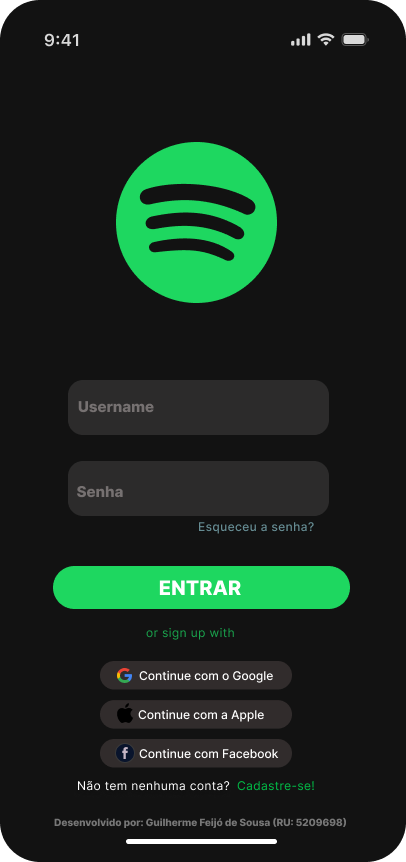
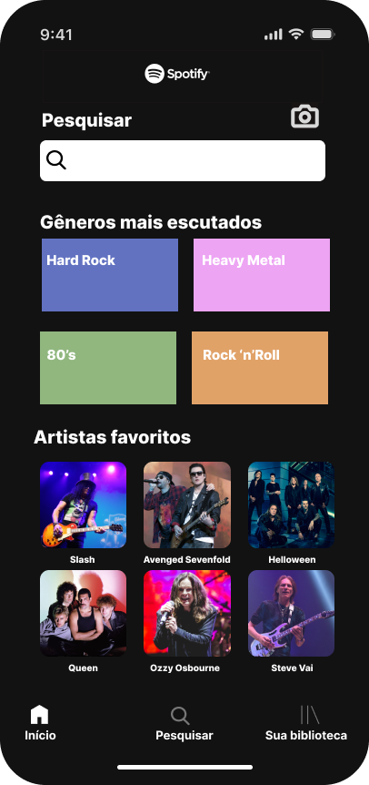
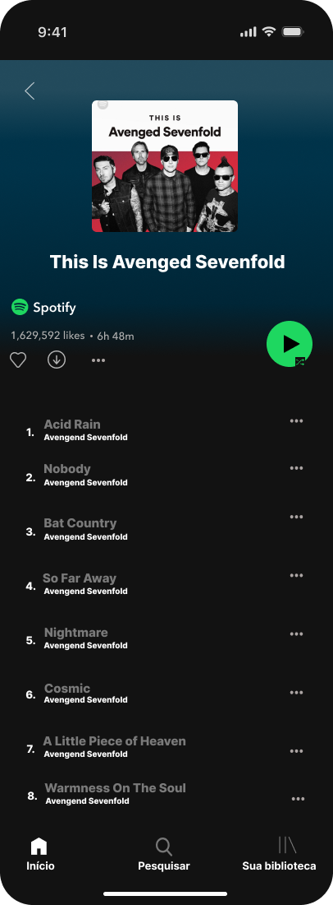
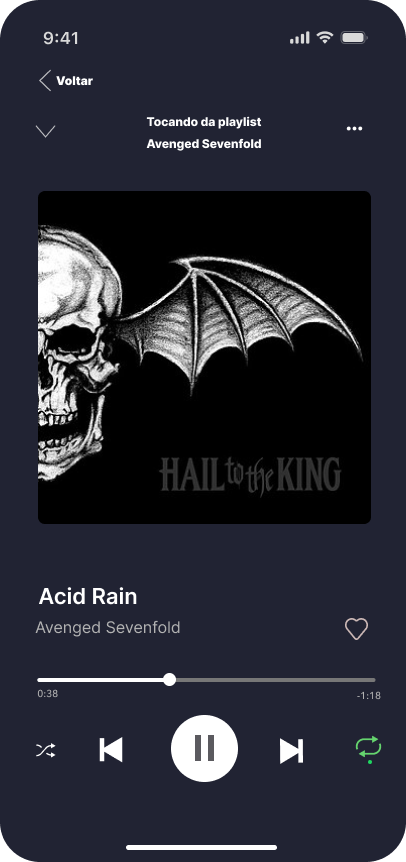

🎧 Protótipo de Aplicativo de Streaming

Este projeto consiste em um **protótipo de aplicativo de streaming** desenvolvido no **Figma**, inspirado na interface do **Spotify**.  

**Aviso Importante:** O protótipo foi criado **apenas para fins educacionais**, como parte de uma tarefa acadêmica na disciplina do curso de **Análise em Desenvolvimento de Sistemas** do Centro Universitário Internacional. Não há qualquer vínculo oficial com o Spotify ou uso comercial deste design.

---

 📌 Objetivos
- Praticar o uso da ferramenta **Figma** para criação de interfaces.  
- Reproduzir conceitos de **UI/UX** aplicados em plataformas de streaming.  
- Exercitar documentação e compartilhamento de projetos no **GitHub**.  

---

📂 Acesso ao Protótipo
O protótipo pode ser acessado diretamente no Figma através dos links abaixo:  
https://www.figma.com/proto/1tA1m8LSTvThiapJ8H1AOQ/Trabalho-Pr%C3%A1tico---Design-de-Intera%C3%A7%C3%A3o?node-id=0-1&t=vf0IkJRPyW6lo43G-1

---

Protótipo (Screenshots)

### Tela Inicial

### Tela de Pesquisa

### Tela de Playlist

### Tela de Player

---

🛠️ Tecnologias e Ferramentas
- [Figma](https://figma.com) – Design e prototipação.  
- GitHub – Versionamento e documentação.  

---

## 📚 Observações
Este repositório é parte de uma **atividade acadêmica** e não tem fins lucrativos.  
